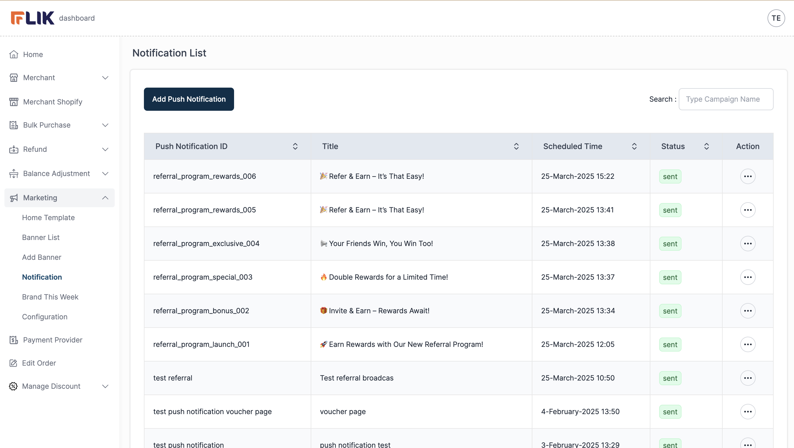
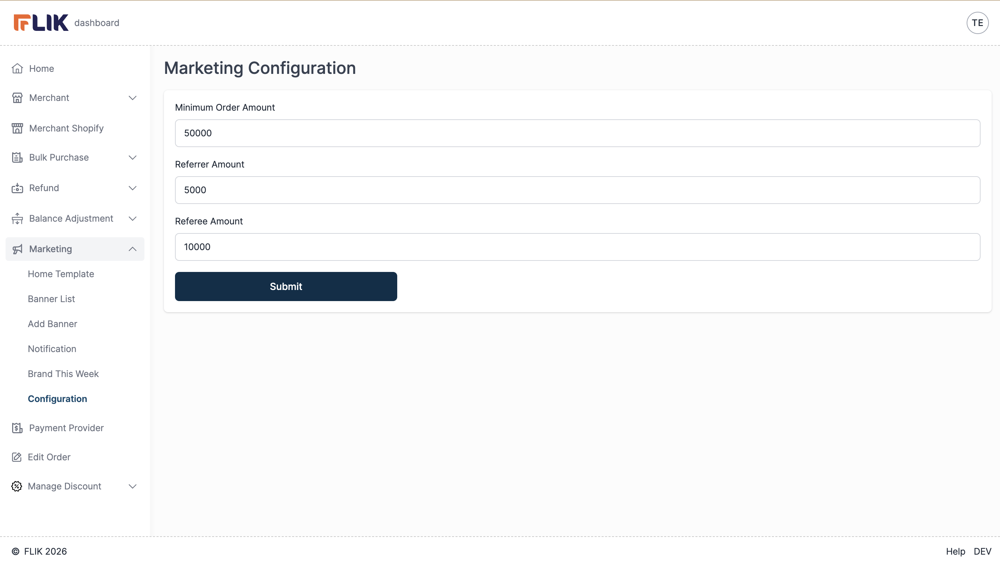

# Marketing Overview

## Overview

The Marketing module provides administrators with tools to manage marketing campaigns, promotions, notifications, and content distribution. This module includes banner management, push notifications, product promotions, and template configuration.

## Core Components

### Banner Management

- **Create Banners**: Design and publish promotional banners
- **Banner List**: View all active and inactive banners
- **Add Banner**: Create new banner campaigns
- **Banner Configuration**: Set banner placement, duration, and targeting

### Push Notifications

- **Send Notifications**: Create and deliver push notifications to users
- **Notification History**: View all sent notifications
- **Add Push Notification**: Create new notification campaigns
- **Update Notifications**: Modify existing notification settings

### Brand This Week (BTW)

- **Product Promotions**: Manage weekly product promotions
- **Add BTW Product**: Add products to Brand This Week promotion
- **BTW Management**: Create and manage promotion schedules

### Home Template

- **Template Configuration**: Configure home page template
- **Layout Management**: Manage home page layout and sections
- **Content Customization**: Customize home page content display

### Marketing Configuration

- **Platform Settings**: General marketing module settings
- **Feature Configuration**: Enable/disable marketing features
- **Campaign Settings**: Configure campaign parameters

## Navigation

- **Location**: Main Menu > Marketing
- **Breadcrumb**: Marketing / Marketing Overview

## Workflows

### Banner Campaign

1. Navigate to Marketing > Banner
2. Click "Add Banner" button
3. Design banner content
4. Set banner schedule and targeting
5. Configure placement on platform
6. Publish banner
7. Banner appears in list and on platform

### Push Notification Campaign

1. Navigate to Marketing > Notification
2. Click "Add Push Notification" button
3. Write notification content
4. Select target audience
5. Set notification schedule
6. Send notification
7. Track notification delivery

### Brand This Week Promotion

1. Navigate to Marketing > Brand This Week
2. Click "Add BTW Product" button
3. Select product to promote
4. Set promotion period
5. Configure display settings
6. Activate promotion
7. Product appears in BTW section

### Home Template Configuration

1. Navigate to Marketing > Home Template
2. Edit template layout
3. Configure content sections
4. Set featured content
5. Save template configuration
6. Changes take effect on home page

## Related Modules

- [Manage Discount](/docs/marketing/manage-discount.md) - Discount management
